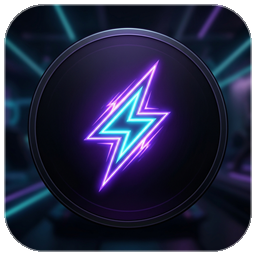

# ⚡ STORM FELLOWSHIP

  <b>Интерактивная звуковая панель (Soundboard) и менеджер аудио-эффектов для стримов и голосовых чатов.</b>

---

## 🌟 О проекте / Overview

**STORM FELLOWSHIP** — компонент программного комплекса **STORM**, разработанный с упором на максимальную производительность, современный дизайн и надёжность.

* **Версия:** $ver
* **Издатель:** STORM TEAM
* **Ведущий разработчик:** ReiKatari
* **Технологический стек:** $tech

---

## 🚀 Установка / Installation

Установка производится через единый инсталлятор **STORM INSTALLER**:

1. Запустите файл STORM_STORM_FELLOWSHIP_0.2.3_Setup.exe.
2. Выберите режим:
   * **Стандартная установка** — установка в C:\Program Files\STORM FELLOWSHIP с созданием ярлыков и регистрацией в системе.
   * **Портативная версия** — распаковка в любую выбранную папку без изменения реестра.
3. Опция автоматической регистрации доверенного сертификата STORM TEAM исключает предупреждения SmartScreen и Smart App Control.

---

## 🛡️ Безопасность и Цифровая подпись / Code Signing

Все исполняемые файлы и инсталляторы подписаны сертификатом **STORM TEAM** с использованием хэширования SHA-256 и RFC 3161 Timestamping.

* Для ручной установки сертификата в хранилище доверенных корневых центров запустите:
  Files\Разблокировать_И_Установить_Сертификат.bat от имени Администратора.

---

## 📁 Структура репозитория / Structure

* Assembling/ — скомпилированные релизные бинарные файлы и зависимости программы.
* Files/ — инсталлятор, сертификат STORM_Certificate.cer и сервисные скрипты.
* Sources/ — исходный код решения.

---

## 👥 Авторы и Лицензия / Credits

* **Разработчик:** [ReiKatari](https://github.com/ReiKatari)
* **Издатель:** **STORM TEAM**
* © 2026 STORM TEAM. Все права защищены.